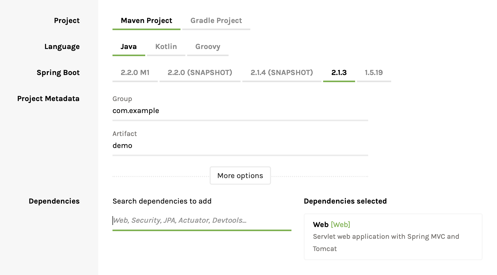

# Cloud Lab

Cloud Native Lab - Simple Workshop demonstrating Cloud-Native development with Spring Boot and Pivotal Cloud Foundry.

# Items covered:

## Spring Boot

* Initializr
* Web and Test

## PCF

## PCF

## Prerequisites

### Modern Java JDK Installed (at-least Java8)

### Cloud Foundry Command Line Interface (cf CLI) installed

[https://docs.cloudfoundry.org/cf-cli/install-go-cli.html](https://docs.cloudfoundry.org/cf-cli/install-go-cli.html)

### Java IDE of choice ..

Intellij recommended .. The Community addition is free.

Using an non-Java IDE, can cause issues with test formatting as well as lack of "auto imports".

### Access to a Pivotal Cloud Foundry instance

Access will be provided during the workshop, or you can sign-up for a free access at : https://run.pivotal.io

## 0 - Initialization

Key points:
* Spring Boot Initializr
* Maven
* Maven Wrapper

### 0.1 - Generate a Spring Boot Template from https://start.spring.io
Stick to the default settings, however update:
- for dependencies add **Web**



Download it, and unzip it.

> NOTE - Make sure that the **Web** Dependency was added -- you should see *spring-boot-starter-web* in your pom.xml

Note the mvnw file:
This is the Wrapper components for Maven: ensuring build script version consistency, removing the dependency of having these build tools installed , and simplifying CI build agent dependencies (only a JDK will be required).

### 0.2 - Import the project into your IDE

Note make sure to do an *import* and not just *open* , to allow for your IDE to correctly pull down dependencies.

## 1 - WebApplication with SpringBoot

Key points:
* Spring Boot Web
* Creating a Simple Helloworld endpoint
* Running the App locally
* No XML!

### 1.1 - Implement a HelloWorld endpoint
This can be done by creating a *HelloWorldController* Java class file with:


```java
package com.example.demo;

import org.springframework.web.bind.annotation.RequestMapping;
import org.springframework.web.bind.annotation.RestController;

@RestController
public class HelloWorldController {

    @RequestMapping("/")
    public String index(){
        return "Hello world";
    }

}
```

### 1.2 - Run the application

> NOTE: Maven instructions are for Bash/Linux/MacOS ... for Windows , replace calls to *./mvnw* with *mvnw.cmd*

```sh
./mvnw spring-boot:run
```

On Windows machines:

```sh
mvnw.cmd spring-boot:run
```

> NOTE: if you have trouble running Maven Wrapper (mvwn) it is most likely due to Proxy issues,  try regular Maven (not wrapper)

---

To build the artifact:

Run:

```sh
./mvnw package
```

On Windows machines:

```sh
mvnw.cmd package
```

To run your built application: 

```sh
java -jar ./target/demo-0.0.1-SNAPSHOT.jar
```

Note Tomcat is embedded inside of the build artifact (you don't need an external application Server).

### 1.3 - Test the root endpoint
The address will be: localhost:8080

You can test via a browser or commandline:
```sh
curl localhost:8080
```

### 1.4 - BONUS - Add Unit Tests for HelloWorld endpoint
This can be done by creating a *HelloWorldControllerTests* Java class file in the test/java directory with:

```java

import org.junit.Test;
import org.junit.runner.RunWith;
import org.springframework.beans.factory.annotation.Autowired;
import org.springframework.boot.test.context.SpringBootTest;
import org.springframework.boot.test.web.client.TestRestTemplate;
import org.springframework.test.context.junit4.SpringRunner;

import static org.assertj.core.api.AssertionsForClassTypes.assertThat;

@RunWith(SpringRunner.class)
@SpringBootTest(webEnvironment = SpringBootTest.WebEnvironment.RANDOM_PORT)
public class HelloWorldControllerTests {

    @Autowired
    private TestRestTemplate restTemplate;

    @Test
    public void testHelloWorld(){
        String body = restTemplate.getForObject("/",String.class);

        assertThat(body).contains("Hello world");
    }
}
```

With Intellij, you can now run the Test by right clicking on it.

From the commandline you can run them with:

```sh
./mvwn test
```

On Windows machines:

```sh
mvnw.cmd test
```

